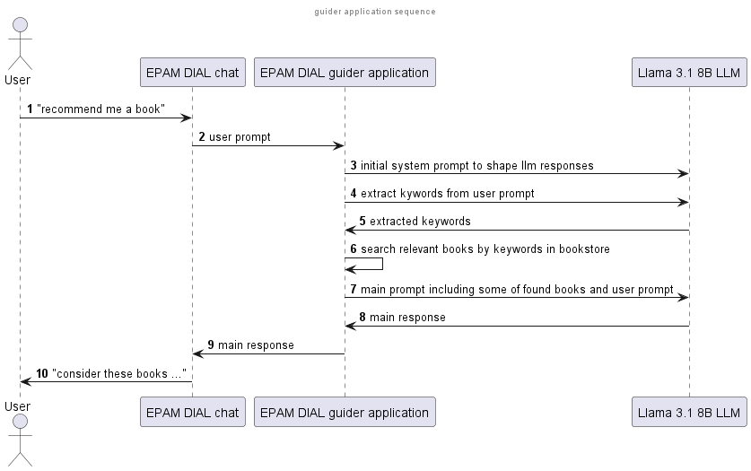

# guider
## What is it

Guider is small [EPAM DIAL](https://github.com/epam/ai-dial) application which resides in between user and LLM. 
Guider application engineers user prompts before sending them to LLM.  
The goal of such engineering - have LLM to help user decide which book from predefined books list to choose. 

Guider prompt engineering consists of:
- once per conversation setting up LLM to act as professional bookstore assistant
- extracting keywords from user prompt and searching through [bookstore](https://github.com/ozlerhakan/mongodb-json-files/blob/master/datasets/books.json) for relevant titles
- constructing new prompt based on user prompt with instructions to LLM to consider limited amount of books found in 
bookstore as the priority items to suggest to user

## Install
Make sure you have docker and docker-compose installed. 
Install [Ollama](https://ollama.com/) and run it locally with any of llama3.1 models. 
Clone the repository to a folder on you machine 
`cd guider` 
Update Ollama base_url in [app.py](/dial-docker-compose/application/guider/app.py) to actual one. 
`cd dial-docker-compose/application` 
`docker compose up --build`
## Run
Open [EPAM chat](http:/localhost:3000)

